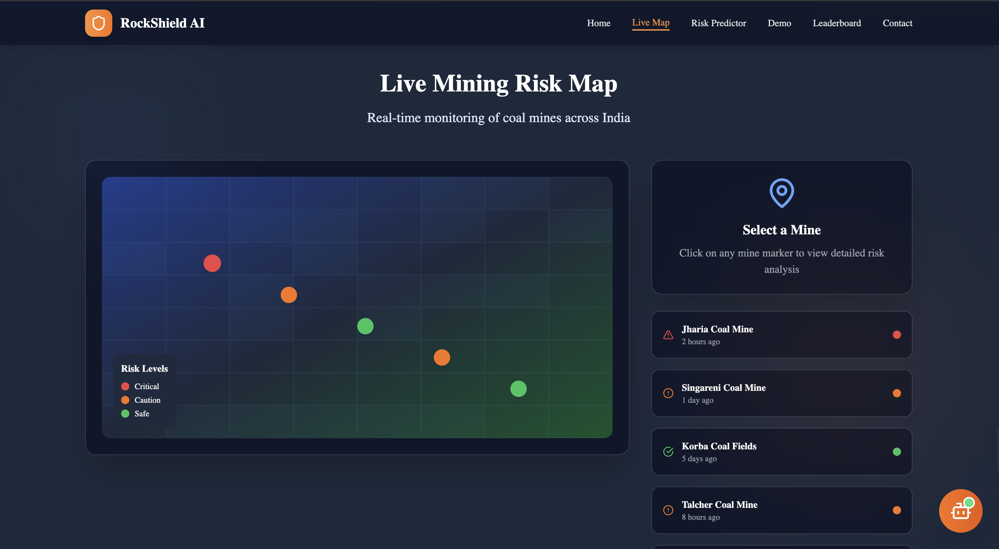

# 🚨 RockShield AI

**AI-Powered Rockfall Prediction & Real-Time Alert System for Open-Pit Mines**

---

## Table of Contents
- [Overview](#overview)
- [Features](#features)
- [Recent Updates](#recent-updates)
- [Architecture](#architecture)
- [Tech Stack](#tech-stack)
- [Project Structure](#project-structure)
- [Quick Start](#quick-start)
- [Usage Guide](#usage-guide)
- [Screenshots](#screenshots)
- [API Documentation](#api-documentation)
- [Contributing](#contributing)
- [License](#license)
- [Team & Contributors](#team--contributors)
- [FAQ](#faq)

---

## Overview

RockShield AI is a **comprehensive rockfall prediction and real-time alert system** designed specifically for **open-pit mining operations**. The platform combines **AI/ML models, IoT sensor integration, satellite imagery, and interactive dashboards** to help mining operations predict rockfall hazards, analyze slope stability, and maximize worker safety.

> **Real-time risk assessment, interactive satellite mapping, detailed analytics, and automated alerts - all in one scalable, low-cost, life-saving solution.**

---

## Features

### 🎯 Core Capabilities

- **🤖 AI-Powered Risk Prediction**
  - Machine learning models (XGBoost, Random Forest) for rockfall probability assessment
  - Slope stability analysis with Factor of Safety (FoS) calculations
  - Real-time risk classification (High/Medium/Low)
  - Confidence scoring and probability metrics

- **🛰️ Interactive Satellite Map**
  - Live satellite imagery using ESRI World Imagery
  - Terrain view toggle for topographical analysis
  - 9 coal mining regions across India with risk zone overlays
  - 285+ active mine locations tracked
  - Color-coded risk zones (red = high risk, green = medium risk)
  - Clickable zones/markers with detailed risk information
  - Interactive popups showing zone names, mine counts, and risk scores

- **📊 Risk Analytics Dashboard**
  - Comprehensive analytics with 6 interactive charts
  - Risk distribution across Indian mining locations
  - Monthly incident trends and seasonal patterns
  - Risk trigger analysis (rainfall, earthquake, human activity, natural erosion)
  - Location-based filtering and statistics
  - Bar charts, pie charts, area charts, and line graphs

- **🔮 Real-Time Prediction System**
  - Rockfall risk assessment with customizable parameters
  - Slope stability calculations with Factor of Safety (FoS)
  - Circular gauge visualizations for instant risk assessment
  - Color-coded results (red/orange/green)
  - Professional empty states and loading animations
  - Contextual safety recommendations

- **🌐 Modern Web Interface**
  - Beautiful gradient backgrounds with glassmorphism effects
  - Smooth Framer Motion animations throughout
  - Responsive design for desktop, tablet, and mobile
  - Consistent design language across all pages
  - Intuitive navigation with quick action buttons
  - Professional typography using Poppins font family

### 📡 Alert & Communication

- **Automated SMS/Email Alerts** (Twilio/SendGrid integration ready)
- **Risk threshold notifications**
- **Real-time alert triggers based on ML predictions**

### 📊 Analytics & Insights

- **Explainable AI** with SHAP and LIME integration
- **Historical trend analysis**
- **Risk pattern recognition**
- **Safety margin calculations**

---

## Recent Updates

### ✨ Latest Features (November 2025)

#### 🛰️ Satellite Map Feature
- Added interactive satellite map with live imagery
- Integrated 9 coal mining regions across India
- Implemented risk zone overlays with clickable polygons
- Added satellite/terrain view toggle
- Created GeoJSON data structure for 285+ mine locations
- Built "Insights to Safety" educational panel

#### 📊 Risk Analytics Dashboard
- Comprehensive analytics page with 6 interactive charts
- Location-based filtering system
- Monthly trends and seasonal analysis
- Risk trigger breakdown (rainfall, earthquake, human activity, erosion)
- Statistics cards showing risk distribution
- Real-time data visualization

#### 🎨 Prediction Page Interface Redesign
- Complete UI overhaul with glassmorphism effects
- Replaced helicopter icon with mountain emoji (⛰️)
- Circular gauge visualizations for results
- Improved form inputs with icons
- Enhanced loading states and animations
- Professional empty states

---

## Architecture

### System Components

1. **Frontend Layer** (React + TypeScript)
   - Hero page with feature highlights
   - Interactive satellite map
   - Risk analytics dashboard
   - Prediction interface
   - Navigation and routing

2. **Backend Layer** (Python Flask)
   - REST API endpoints
   - ML model serving
   - Data processing pipeline
   - Analytics calculations

3. **ML Models** (XGBoost, Random Forest)
   - Rockfall risk classification
   - Slope stability analysis
   - Feature engineering
   - Model inference

4. **Data Layer**
   - GeoJSON risk zone data
   - Mining location database
   - Historical incident data
   - Sensor data integration (ready)

### Data Flow

```
User Input → Frontend → REST API → ML Models → Predictions → Frontend Display
                                          ↓
                                   Analytics Engine
                                          ↓
                                   Risk Assessment
                                          ↓
                            Alert System (if threshold exceeded)
```

---

## Tech Stack

### Frontend
- **Framework**: React 18 with TypeScript
- **Build Tool**: Vite
- **Styling**: TailwindCSS
- **Animations**: Framer Motion
- **Maps**: Leaflet.js + React-Leaflet
- **Charts**: Recharts
- **Icons**: Lucide React
- **Routing**: React Router DOM

### Backend
- **Framework**: Flask (Python)
- **ML Libraries**: scikit-learn, XGBoost, pandas, numpy
- **Model Persistence**: joblib
- **API**: RESTful endpoints

### DevOps & Tools
- **Linting**: ESLint
- **CSS Processing**: PostCSS
- **Package Manager**: npm

### Integrations (Ready)
- **SMS Alerts**: Twilio
- **Email Alerts**: SendGrid
- **Explainable AI**: SHAP, LIME
- **Satellite Data**: ESRI World Imagery, ISRO Bhuvan (configurable)

---

## Project Structure

```
RockShield-AI/
├── src/                          # Frontend source code
│   ├── Components/              # React components
│   │   ├── Hero.tsx             # Homepage hero section
│   │   ├── SatelliteMap.tsx     # Interactive satellite map
│   │   ├── RiskAnalytics.tsx    # Analytics dashboard
│   │   ├── PredictionPage.tsx   # Risk prediction interface
│   │   ├── Navigation.tsx       # Navigation bar
│   │   ├── Footer.tsx           # Footer component
│   │   └── ...
│   ├── data/                    # Static data and GeoJSON
│   │   └── coalRiskZones.ts     # Mining regions data
│   ├── Types/                   # TypeScript type definitions
│   ├── App.tsx                  # Main app component
│   ├── main.tsx                 # Entry point with routing
│   └── index.css                # Global styles
│
├── ml-service/                  # Python ML backend
│   ├── app.py                   # Flask REST API
│   ├── models/                  # Trained ML models
│   ├── generate_models.py       # Model training script
│   ├── requirements.txt         # Python dependencies
│   └── templates/               # HTML templates (if needed)
│
├── models/terranox/             # Terranox ML integration
├── tests/                       # Test files
├── .config/                     # Configuration files
├── package.json                 # Node dependencies
├── tsconfig.json                # TypeScript configuration
├── vite.config.ts               # Vite configuration
├── tailwind.config.js           # Tailwind CSS config
├── .env.example                 # Environment variables template
├── README.md                    # This file
├── IMPLEMENTATION_SUMMARY.md    # Satellite map documentation
├── RISK_ANALYTICS_FEATURE.md    # Analytics documentation
├── PREDICTION_PAGE_UPDATE.md    # Prediction page documentation
└── RockShield-AI.png            # Project screenshot
```

---

## Quick Start

### Prerequisites

- Node.js (v18 or higher)
- Python (v3.8 or higher)
- npm or yarn
- pip

### Installation

#### 1. Clone the Repository

```bash
git clone https://github.com/Adesh2204/RockShield-AI.git
cd RockShield-AI
```

#### 2. Set Up Frontend

```bash
# Install dependencies
npm install

# Start development server
npm run dev
```

The frontend will run on `http://localhost:5175/`

#### 3. Set Up ML Backend

```bash
# Navigate to ml-service directory
cd ml-service

# Install Python dependencies
pip install -r requirements.txt

# Start Flask server
python app.py
```

The backend API will run on `http://localhost:5001/`

#### 4. Access the Application

- **Homepage**: http://localhost:5175/
- **Satellite Map**: http://localhost:5175/satellite-map
- **Risk Analytics**: http://localhost:5175/analytics
- **Prediction**: http://localhost:5175/predict

---

## Usage Guide

### Navigating the Platform

#### Homepage
- View feature highlights and system overview
- Access all major features via action buttons
- **"Launch Live Demo"** → Go to prediction page
- **"Risk Analytics"** → View analytics dashboard
- **"Satellite Map"** → Explore interactive map

#### Satellite Map (`/satellite-map`)
1. **View Risk Zones**: Red polygons indicate high-risk areas, green for medium risk
2. **Toggle Views**: Switch between satellite and terrain imagery
3. **Click Zones**: Get detailed information about mining regions
4. **Explore Locations**: 9 regions across India with 285+ mine locations
5. **Navigate**: Use quick action buttons to access other features

#### Risk Analytics Dashboard (`/analytics`)
1. **View Statistics**: High risk %, medium risk %, regions monitored
2. **Filter by Location**: Dropdown to view specific region data
3. **Analyze Charts**:
   - Bar chart: Risk distribution by location
   - Pie chart: Overall risk breakdown
   - Area chart: Monthly incident trends
   - Line chart: Risk score progression
   - Horizontal bar: Risk trigger analysis
4. **Hover for Details**: Interactive tooltips on all charts

#### Prediction Page (`/predict`)

**Rockfall Risk Assessment**:
1. Fill in parameters:
   - Latitude and Longitude
   - Rainfall (mm)
   - Triggers (count)
   - Landslide size
   - Administrative division
2. Click "Predict Risk Level"
3. View results:
   - Risk percentage (circular gauge)
   - Classification (High/Medium/Low)
   - Probability and confidence metrics

**Slope Stability Analysis**:
1. Fill in technical parameters:
   - Cohesion
   - Friction angle
   - Unit weight
   - Slope height and angle
   - Water pressure
   - Reinforcement type
2. Click "Calculate Factor of Safety"
3. View results:
   - Factor of Safety (FoS) value
   - Stability status (Unstable/Marginal/Stable)
   - Safety margin assessment
   - Interpretation guide

### API Endpoints

#### Rockfall Risk Prediction
```
POST /predict
Content-Type: application/json

{
  "latitude": 22.5726,
  "longitude": 88.3639,
  "rainfall": 150.5,
  "triggers": 3,
  "landslide_size": "medium",
  "administrative_division": "West Bengal"
}

Response:
{
  "risk_probability": 65.4,
  "risk_class": "MEDIUM",
  "confidence": 0.87
}
```

#### Slope Stability Calculation
```
POST /predict-fos
Content-Type: application/json

{
  "cohesion": 25.0,
  "friction_angle": 30.0,
  "unit_weight": 18.5,
  "slope_height": 15.0,
  "slope_angle": 45.0,
  "water_pressure": 50.0,
  "reinforcement": "anchors"
}

Response:
{
  "factor_of_safety": 1.45,
  "status": "MARGINAL",
  "safety_margin": "Acceptable with monitoring"
}
```

#### Analytics Data
```
GET /analytics

Response:
{
  "location_data": [...],
  "monthly_trends": [...],
  "risk_distribution": [...],
  "triggers": [...],
  "summary": {...}
}
```

---

## Screenshots



*Interactive dashboard showing DEM-based mine map with AI-driven risk heatmap and real-time notifications.*

---

## API Documentation

For detailed API documentation, see:
- [IMPLEMENTATION_SUMMARY.md](IMPLEMENTATION_SUMMARY.md) - Satellite map feature
- [RISK_ANALYTICS_FEATURE.md](RISK_ANALYTICS_FEATURE.md) - Analytics dashboard
- [PREDICTION_PAGE_UPDATE.md](PREDICTION_PAGE_UPDATE.md) - Prediction interface

---

## Contributing

Contributions are welcome! To contribute:

1. **Fork the repository**
2. **Create a feature branch**:
   ```bash
   git checkout -b feature/amazing-feature
   ```
3. **Commit your changes**:
   ```bash
   git commit -m "Add amazing feature"
   ```
4. **Push to the branch**:
   ```bash
   git push origin feature/amazing-feature
   ```
5. **Open a Pull Request**

### Development Guidelines

- Follow TypeScript/React best practices
- Maintain consistent code style (ESLint)
- Write descriptive commit messages
- Test thoroughly before submitting
- Update documentation as needed

---

## License

This project is licensed under the **MIT License**.  
See [LICENSE](LICENSE) file for details.

---

## Team & Contributors

### Core Team
- **Adesh** - [@Adesh2204](https://github.com/Adesh2204) - Lead Developer
- **Aniket Veer Koppaka** - [@Aniketkoppaka](https://github.com/Aniketkoppaka) - ML Engineer
- **Aagam Kala** - [@aagam-kala2005](https://github.com/aagam-kala2005) - Frontend Developer

### Special Thanks
To all contributors and supporters who made this project possible!

---

## FAQ

**Q: What sensors are compatible with RockShield-AI?**  
A: Any device capable of sending data in JSON format. Mock scripts for Arduino/Raspberry Pi are provided for testing. Real sensor integration requires basic API connectivity.

**Q: How do I deploy this in production?**  
A: 
- Frontend: `npm run build` and serve the `dist/` folder
- Backend: Use Gunicorn/WSGI with Flask, set up proper environment variables
- Database: Configure production database for sensor data
- Security: Implement authentication, HTTPS, rate limiting

**Q: Can I customize the ML models?**  
A: Yes! Train new models using `ml-service/generate_models.py` or replace existing models in `ml-service/models/`. The system supports any scikit-learn compatible model.

**Q: How accurate are the predictions?**  
A: The models are trained on synthetic data for demonstration. For production use, retrain with real-world data from your specific mining operations for best accuracy.

**Q: Can I add more mining regions?**  
A: Yes! Edit `src/data/coalRiskZones.ts` to add new GeoJSON polygons and markers for additional regions.

**Q: Is there a mobile app?**  
A: Currently web-only, but the responsive design works well on mobile browsers. A dedicated mobile app is planned for future releases.

**Q: How do I integrate real IoT sensors?**  
A: Configure sensor devices to POST data to the Flask API endpoints. The `.env.example` file shows required environment variables. Contact the team for sensor integration guides.

**Q: Can I use this for other types of mining?**  
A: Yes! The system is adaptable. You'll need to retrain models with relevant data and update the risk zone definitions for your specific mining type.

---

## Contact & Support

For questions, issues, or feature requests:
- **GitHub Issues**: [RockShield-AI/issues](https://github.com/Adesh2204/RockShield-AI/issues)
- **Email**: Contact via GitHub profiles

---

**Built with ❤️ for safer mining operations worldwide**

---

*Last Updated: November 6, 2025*
